# TP1 : Modèles de langage - CI4

## Informations générales

**Étudiant** : AMDOUNI Firiel
**Date** : 8 janvier 2026

## Environnement de développement

### Configuration système
- **Système d'exploitation** : Windows
- **Version Python** : Python 3.13.3 

### Installation de l'environnement

```bash
# Création de l'environnement virtuel
python -m venv venv

# Activation de l'environnement
.\venv\Scripts\activate

# Installation des dépendances
pip install -r requirements.txt
```

### Versions des bibliothèques principales
- `transformers` : 4.36.0
- `torch` : 2.1.0
- `plotly` : 5.18.0
- `scikit-learn` : 1.3.0
- `numpy` : 1.24.0

### Seed pour la reproductibilité
Toutes les expériences de génération utilisent le seed : **42**

---

## Exercice 1 : Organisation du dépôt

### Question 1.a - Structure du dépôt

Le dépôt est organisé comme suit :
```
TP1/
├── rapport.md          # Ce fichier
├── requirements.txt    # Dépendances Python
├── img/               # Captures d'écran et visualisations
└── code/              # Scripts et notebooks
```

### Question 1.b - En-tête et informations

Voir ci-dessus pour les informations sur l'environnement et les versions.

---

## Exercice 2 : Découverte du tokenizer GPT-2

### Question 2.a - Tokenisation de base

J'ai testé la phrase "Artificial intelligence is metamorphosing the world!"

**Résultat obtenu :**

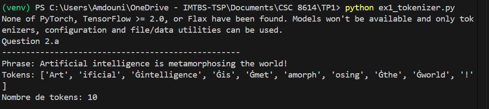

**Explication du symbole Ġ :**

Le symbole "Ġ" représente un espace dans le système de tokenisation de GPT-2. Quand on voit "Ġintelligence", cela signifie qu'il y avait un espace avant le mot "intelligence" dans le texte original. Cette notation est essentielle pour que le modèle puisse reconstruire correctement le texte avec les espaces aux bons endroits. Par exemple, "Art" n'a pas de Ġ devant parce qu'il est en début de phrase, tandis que "Ġis" en a un car il y a un espace avant ce mot.

---

### Question 2.b - Token IDs et décodage

**Liste des IDs obtenus :**

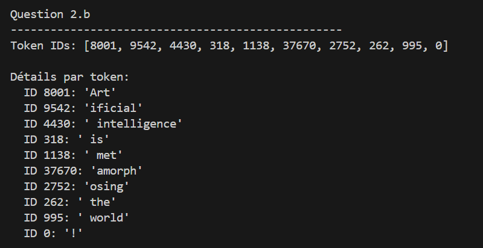


**Tableau détaillé :**

| ID    | Décodage        | Remarque                  |
|-------|-----------------|---------------------------|
| 8001  | 'Art'           | Début du mot              |
| 9542  | 'ificial'       | Suite sans espace         |
| 4430  | ' intelligence' | Mot complet avec espace   |
| 318   | ' is'           | Verbe court               |
| 1138  | ' met'          | Début du découpage        |
| 37670 | 'amorph'        | Partie centrale           |
| 2752  | 'osing'         | Fin avec suffixe -ing     |
| 262   | ' the'          | Article                   |
| 995   | ' world'        | Nom                       |
| 0     | '!'             | Ponctuation               |

**Différence entre tokens et token IDs :**

Les tokens sont les morceaux de texte (comme "Ġis" ou "Art"), tandis que les token IDs sont des numéros qui correspondent à ces tokens dans le vocabulaire du modèle. Le modèle GPT-2 utilise les IDs parce que les réseaux de neurones travaillent avec des nombres, pas directement avec du texte. Le tokenizer permet de convertir facilement du texte vers des IDs et inversement.

---

### Question 2.c - Observations sur le découpage

**Observations concrètes basées sur mes tests :**

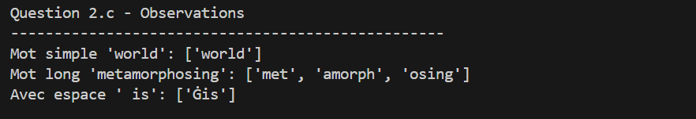

1. **Mots simples :** Les mots courts et fréquents comme "world" forment un seul token. C'est parce que GPT-2 les a vus très souvent pendant son entraînement et les a intégrés directement dans son vocabulaire.

2. **Mots longs ou complexes :** Le mot "metamorphosing" est découpé en 3 morceaux : "met", "amorph", "osing". C'est un mot moins courant, donc le tokenizer le divise en parties plus petites qu'il connaît mieux.

3. **Gestion des espaces :** Quand on tokenise " is" (avec un espace avant), on obtient un seul token "Ġis". L'espace fait partie intégrante du token, ce qui permet au modèle de savoir exactement où placer les espaces dans le texte généré.

**Lien avec le BPE :**

Le principe du Byte Pair Encoding est de fusionner les paires de caractères les plus fréquentes dans les données d'entraînement. Résultat : les mots ou morceaux qu'on voit souvent deviennent des tokens uniques, et les mots rares sont décomposés en sous-parties. Ça permet au modèle de gérer n'importe quel mot, même nouveau, en le décomposant en morceaux connus. C'est beaucoup plus efficace que d'avoir un vocabulaire avec tous les mots possibles.

---

### Question 2.d - Mot très long : antidisestablishmentarianism


**Phrase testée :** "GPT models use BPE tokenization to process unusual words like antidisestablishmentarianism."

**Résultat complet :**

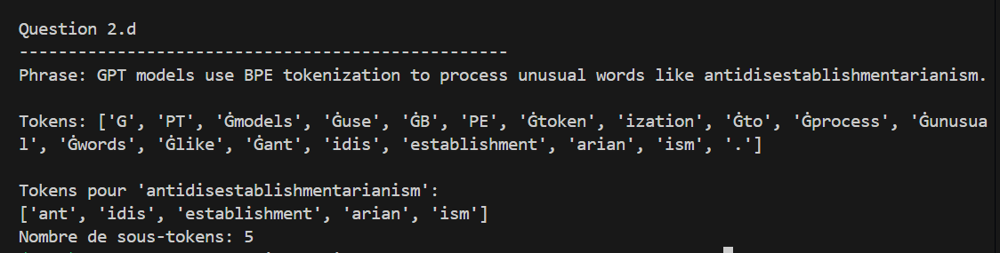

**Découpage du mot long :**

Tokens pour 'antidisestablishmentarianism': ['ant', 'idis', 'establishment', 'arian', 'ism']
Nombre de sous-tokens: 5

**Analyse du découpage :**

Le mot "antidisestablishmentarianism" (28 lettres) est découpé en 5 sous-tokens. Ce mot très rare n'existe probablement pas tel quel dans le vocabulaire du tokenizer, donc il est décomposé intelligemment.

On peut voir que le découpage suit une certaine logique linguistique : "ant" (préfixe), "idis" (partie du préfixe "dis"), "establishment" (mot anglais courant que le tokenizer connaît bien), "arian" (suffixe pour désigner un partisan de quelque chose), et "ism" (suffixe pour une doctrine ou idéologie).

Cette approche est très pratique : au lieu de rejeter un mot inconnu, le BPE le découpe en morceaux qu'il connaît. Ça permet au modèle de quand même saisir une partie du sens du mot grâce à ses composantes, même s'il ne l'a jamais vu en entier durant l'entraînement. C'est un des grands avantages du BPE par rapport aux anciennes méthodes qui remplaçaient simplement les mots inconnus par un token spécial comme <UNK>.

---

## Exercice 3 : Analyse des encodages positionnels dans GPT-2

### Question 3.a - Extraction des encodages positionnels

**Résultats obtenus :**

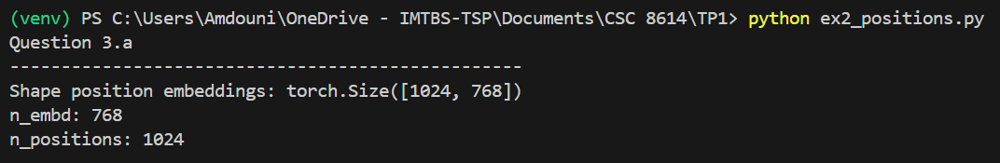

**Interprétation de la shape :**

La matrice [1024, 768] contient 1024 positions (de 0 à 1023), chacune représentée par un vecteur de 768 dimensions. Chaque ligne correspond à l'embedding d'une position spécifique dans la séquence.

**Signification de n_positions :**

Le paramètre n_positions = 1024 définit la longueur maximale du contexte que GPT-2 peut traiter. Au-delà de 1024 tokens, il faut découper le texte car le modèle n'a appris que ces 1024 positions durant l'entraînement.

---

### Question 3.b - Visualisation PCA des positions 0-50

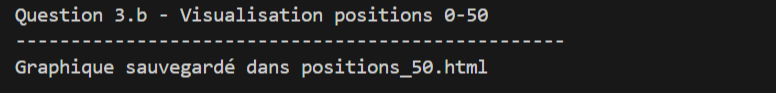
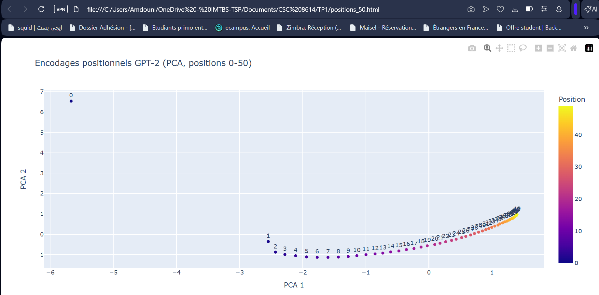


**Observations :**

On observe une trajectoire continue et progressive dans l'espace PCA. Les positions successives (comme 5 et 6) sont proches les unes des autres, formant une sorte de courbe régulière. Il n'y a pas de regroupements distincts mais plutôt un continuum fluide, ce qui montre que le modèle a appris des représentations graduelles pour les positions voisines.

**Intérêt de la PCA :**

Les embeddings ont 768 dimensions, impossibles à visualiser. La PCA réduit à 2 dimensions en conservant l'essentiel de l'information, ce qui permet de voir la structure globale des positions sur un simple graphique.

---

### Question 3.c - Visualisation PCA des positions 0-200


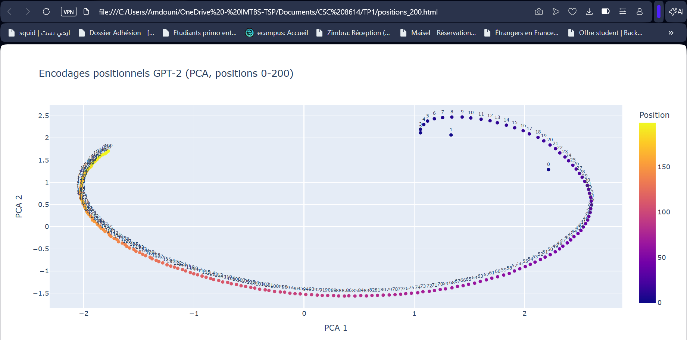

**Comparaison 0-50 vs 0-200 :**

Avec 200 positions, la trajectoire est plus longue et les points sont plus denses. La structure reste continue mais on aperçoit des variations dans la courbe qui n'étaient pas visibles avec seulement 50 points. L'échelle change et rend les détails individuels moins nets.

**Hypothèse :**

Le modèle encode les positions de manière continue plutôt que catégorielle. Au lieu d'avoir des vecteurs totalement différents pour chaque position, il crée un "chemin" progressif dans l'espace à 768 dimensions. Cela permet de mieux généraliser et de comprendre les relations de proximité entre positions dans une séquence.

---

## Exercice 4 : Probabilités et génération de texte avec GPT-2

### Question 4.a - Probabilités conditionnelles

**Phrase testée :** "Artificial intelligence is fascinating."

**Résultats obtenus :**

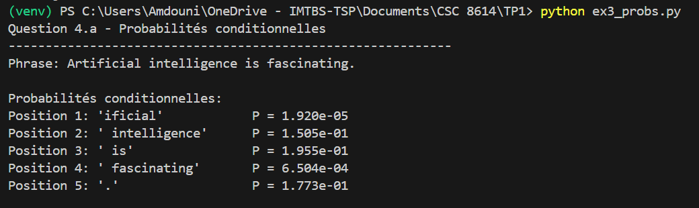

**Explication de l'alignement t-1 :**

On lit la probabilité du token à la position t dans les logits à la position t-1 parce que GPT-2 est un modèle causal. Les logits à la position t-1 contiennent les prédictions pour le token suivant, basées sur tous les tokens précédents. Donc pour prédire le token en position t, le modèle utilise uniquement l'information des positions 0 à t-1.

---

### Question 4.b - Log-probabilité et perplexité

**Résultats obtenus :**

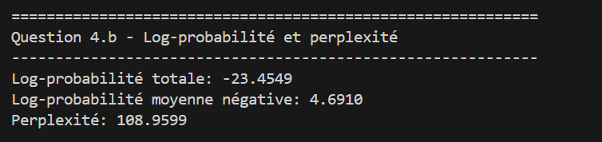

**Interprétation de la perplexité :**

La perplexité mesure à quel point le modèle est "surpris" par la phrase. Une perplexité de 108.96 signifie qu'en moyenne, le modèle hésite entre environ 109 choix possibles à chaque position. Plus la perplexité est basse, plus le modèle est confiant. Une phrase naturelle et grammaticale aura une perplexité plus faible qu'une phrase bizarre.

---

### Question 4.c - Comparaison phrase correcte vs incorrecte

**Résultats obtenus :**

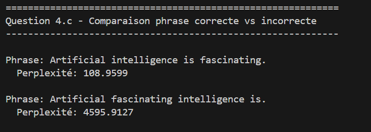

**Analyse :**

La phrase incorrecte a une perplexité beaucoup plus élevée (4595.91 vs 108.96). C'est normal car l'ordre des mots est anormal en anglais. GPT-2 a été entraîné sur des textes grammaticalement corrects, donc il trouve la structure "Artificial fascinating intelligence is" très peu probable. Cette différence montre que le modèle a bien appris les régularités syntaxiques de l'anglais.

---

### Question 4.d - Phrase en français

**Résultat obtenu :**

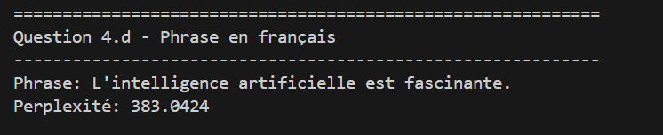

**Comparaison et explication :**

La phrase française a une perplexité plus élevée (383.04) que la phrase anglaise correcte (108.96) mais plus basse que la phrase anglaise incorrecte (4595.91). C'est parce que GPT-2 a été principalement entraîné sur des textes en anglais. Le modèle connaît moins bien le français, donc il est plus surpris par cette phrase même si elle est grammaticalement correcte.

---

### Question 4.e - Top 10 tokens les plus probables

**Préfixe :** "Artificial intelligence is"

**Top 10 propositions obtenues :**

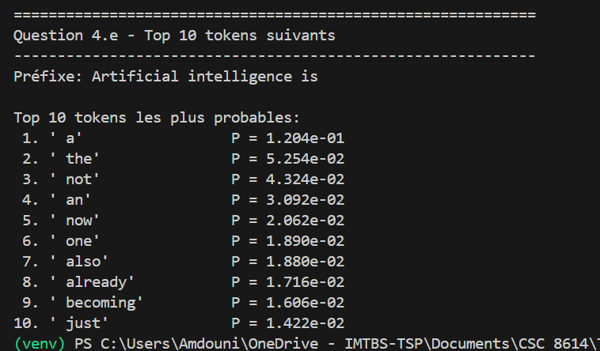

**Commentaire :**

Les propositions sont plausibles et suivent la logique de l'anglais. On voit surtout des articles ("a", "the", "an") et des adverbes ("not", "now", "also", "already"). Ces mots sont naturels après "is" et forment des phrases grammaticalement correctes comme "Artificial intelligence is a..." ou "Artificial intelligence is not...". Le modèle propose des continuations cohérentes.

---

## Exercice 5 : Exploration des méthodes de génération avec GPT-2

### Question 5.a - Configuration

**Seed utilisé :** 42

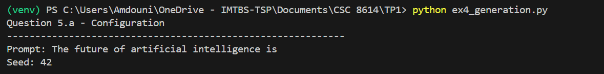

**Pourquoi fixer le seed :**

Fixer le seed permet de rendre les résultats reproductibles. Sans cela, les générations avec sampling seraient différentes à chaque exécution, ce qui rendrait difficile la comparaison et la documentation des résultats.

---

### Question 5.b - Décodage glouton

**Texte généré :**

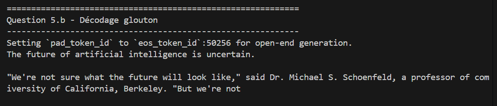

**Test de reproductibilité :**

En relançant le script 3 fois, le texte généré est exactement identique. C'est normal car le décodage glouton est déterministe : il choisit toujours le token le plus probable à chaque étape, sans aléa.

---

### Question 5.c - Sampling avec température, top-k, top-p

**Paramètres :** température=0.7, top-k=50, top-p=0.95

**Exemples de générations (2 extraits) :**

Seed 1:

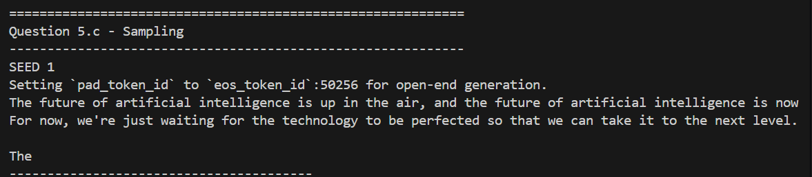


Seed 5:

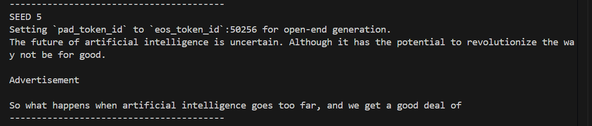


**Comparaison avec greedy :**

Le sampling génère des textes variés à chaque exécution, contrairement au greedy qui est identique. Les textes sont plus naturels et explorent différentes idées. On observe moins de répétitions strictes et plus de diversité dans le vocabulaire.

**Rôle des paramètres :**
- **Température (0.7)** : ajoute du hasard contrôlé dans le choix des tokens
- **Top-k (50)** : limite le choix aux 50 tokens les plus probables
- **Top-p (0.95)** : garde les tokens dont la somme des probabilités atteint 95%

---

### Question 5.d - Pénalité de répétition

**Sans pénalité :**

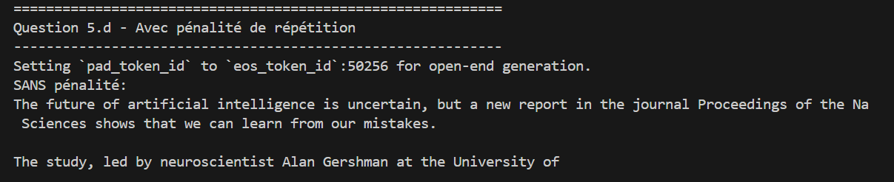

**Avec pénalité (2.0) :**

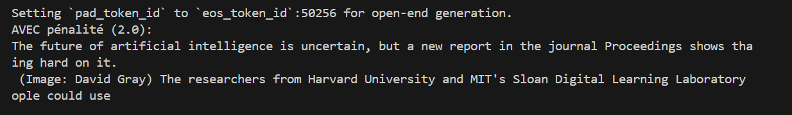


**Commentaire :**

Avec la pénalité, le texte évite de répéter "National Academy of Sciences" et utilise un vocabulaire plus varié. La pénalité force le modèle à explorer d'autres mots, ce qui rend le texte moins répétitif.

---

### Question 5.e - Températures extrêmes

**Température 0.1 (basse) :**

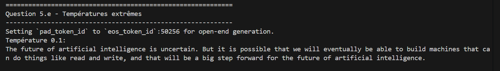

**Température 2.0 (élevée) :**

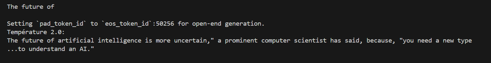

**Compromis cohérence vs diversité :**

Avec une température basse (0.1), le texte est cohérent, bien structuré mais assez prévisible et conventionnel. Avec une température élevée (2.0), le texte devient plus imprévisible et parfois moins fluide (phrases plus courtes, syntaxe bizarre). Une température moyenne offre le meilleur équilibre entre créativité et cohérence.

---

### Question 5.f - Beam search

**Résultat avec beam search (num_beams=5) :**

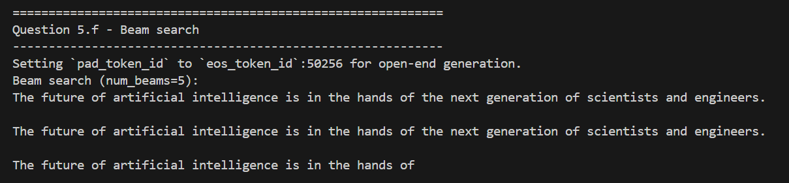


**Comparaison :**

Le beam search produit un texte qui se répète beaucoup. Il maximise la probabilité globale et trouve que répéter la même phrase est le "meilleur" choix. Le texte est très générique et manque de diversité comparé au sampling. C'est plus cohérent que le greedy mais moins créatif.

---

### Question 5.g - Impact du nombre de beams

**Résultats mesurés :**

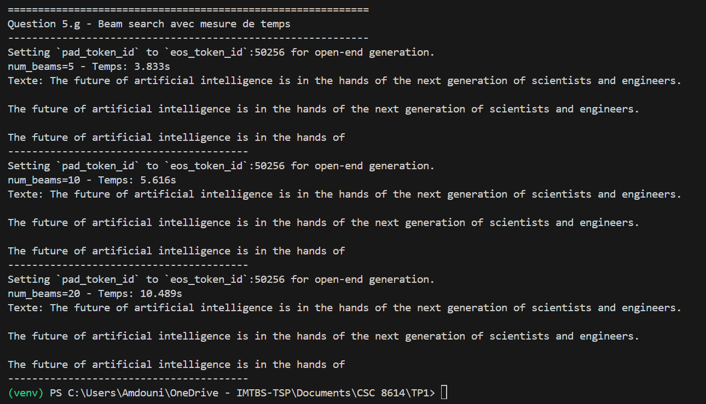

**Explication du ralentissement :**

Plus on augmente le nombre de beams, plus le temps de calcul augmente. Avec 20 beams, le modèle explore 20 chemins en parallèle à chaque étape, ce qui multiplie les calculs. Le temps est presque triplé entre 5 et 20 beams car il faut maintenir et évaluer beaucoup plus d'hypothèses.

---

