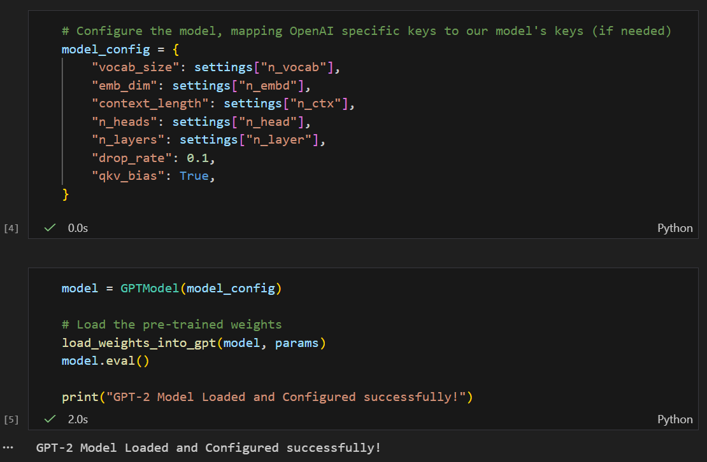
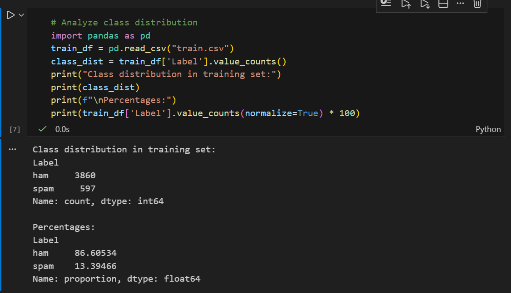
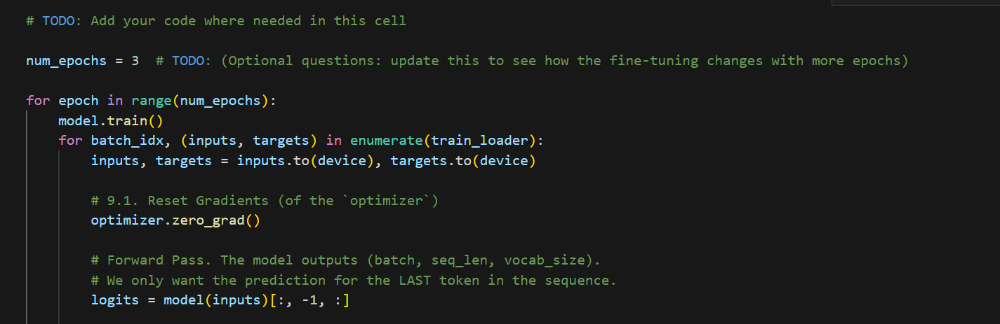
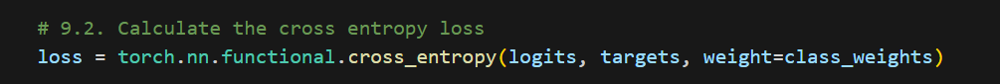
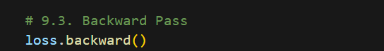
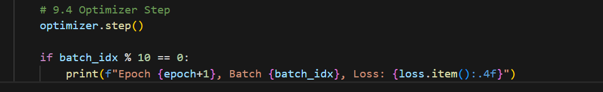
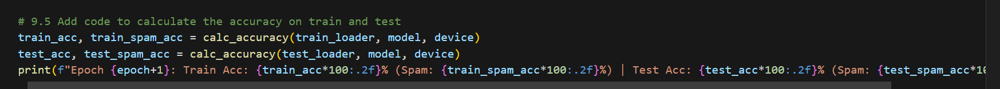
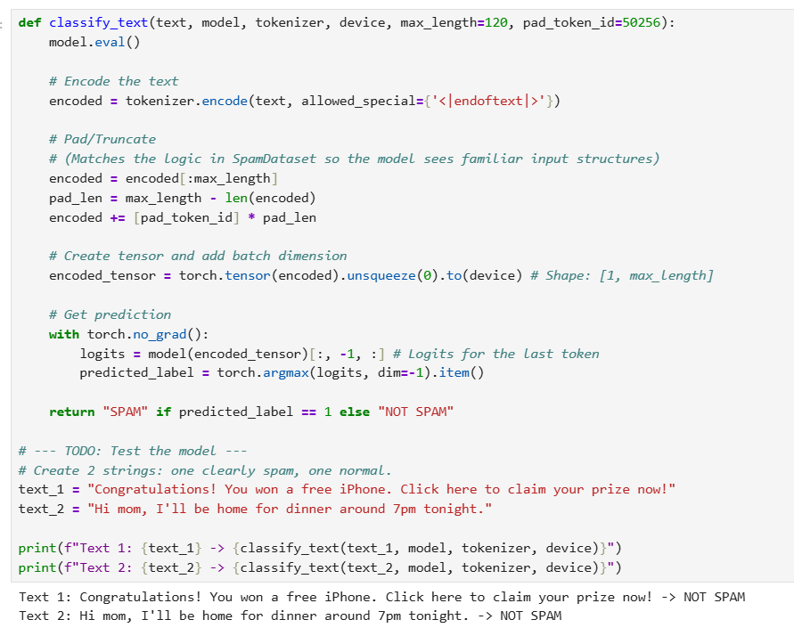

# TP2 - Fine-tuning GPT-2 for Spam Classification

**Name:** AMDOUNI Firiel

**Date:** January 9, 2026

## Configuration
- **OS:** Linux
- **Python:** 3.12.12
- **Installation:** `pip install -r requirements.txt`
- **Main libraries:** torch==2.9.1, tiktoken==0.12.0, pandas==2.3.3
- **Random seed:** 42

---

## Question 2: Type and structure of `settings`

`settings` is a dictionary containing the configuration parameters for the GPT-2 124M model.

Structure: dict with keys 'n_vocab', 'n_ctx', 'n_embd', 'n_head', 'n_layer'

## Question 3: Type and structure of `params`


`params` is a dictionary containing the pre-trained model weights.

Structure: dict with keys corresponding to tensors for different model layers (embeddings, transformer blocks, final normalization)

## Question 4: Structure of cfg and mapping



The `cfg` parameter for GPTModel requires the following keys:
- vocab_size, emb_dim, context_length, drop_rate, n_layers, n_heads, qkv_bias

The `settings` keys (OpenAI format) must be mapped:
- n_vocab → vocab_size
- n_embd → emb_dim  
- n_ctx → context_length
- n_head → n_heads
- n_layer → n_layers

## Question 5.1: Purpose of shuffling with random_state

The `df.sample(frac=1, random_state=123)` shuffles the entire dataset randomly before splitting. This ensures that:
- Training and test sets have similar distributions
- The model doesn't learn from any ordering patterns in the original data
- Results are reproducible (random_state=123 fixes the seed)

## Question 5.2: Class distribution analysis



The training set is **unbalanced**:
- ham (non-spam): ~86.6% 
- spam: ~13.4%

This imbalance can cause issues during fine-tuning:
- The model may become biased towards predicting "ham"
- Poor performance on minority class (spam detection)
- May require class weighting or balanced sampling techniques

## Question 6: DataLoaders creation


Created two DataLoaders:
- `train_loader`: batch_size=16, shuffle=True (for training randomization)
- `test_loader`: batch_size=16, shuffle=False (for consistent evaluation)

## Question 7: Batch calculation


With training size of 4457 samples and batch_size=16:
- Total number of batches: 279 batches
- Calculation: ⌈4457 / 16⌉ = 279

Note: Full training set used (no subsampling applied).

## Question 8: Fine-tuning configuration

### 8.1: Number of output classes
`num_classes = 2` (binary classification: spam vs ham)

### 8.2: Output heads
- Original output head: Linear(768, 50257) - GPT-2 vocabulary size
- New output head: Linear(768, 2) - Binary classification

### 8.3: Why freeze internal layers?
Freezing internal layers with `param.requires_grad = False` is done to:
- Preserve pre-trained knowledge from GPT-2
- Reduce computational cost (fewer parameters to update)
- Prevent overfitting on small dataset
- Only fine-tune the task-specific classification head


## Question 9: Training Loop Implementation

### 9.1: Reset gradients
`optimizer.zero_grad()` - Clears gradients from previous iteration



### 9.2: Compute loss
`loss = torch.nn.functional.cross_entropy(logits, targets, weight=class_weights)`
Uses weighted cross-entropy to handle class imbalance



### 9.3: Backward pass
`loss.backward()` - Computes gradients via backpropagation



### 9.4: Optimizer step
`optimizer.step()` - Updates model weights using computed gradients



### 9.5: Calculate accuracy
`calc_accuracy(train_loader, model, device)` and `calc_accuracy(test_loader, model, device)`
Returns overall accuracy and spam-specific accuracy



Le résultat d'exécution de script : 

```
Epoch 1, Batch 0, Loss: 1.9177
Epoch 1, Batch 10, Loss: 1.0996
Epoch 1, Batch 20, Loss: 1.3287
Epoch 1, Batch 30, Loss: 1.1095
Epoch 1, Batch 40, Loss: 0.5688
Epoch 1, Batch 50, Loss: 1.5038
Epoch 1, Batch 60, Loss: 0.8115
Epoch 1, Batch 70, Loss: 1.0424
Epoch 1, Batch 80, Loss: 0.7385
Epoch 1, Batch 90, Loss: 0.6150
Epoch 1, Batch 100, Loss: 0.7309
Epoch 1, Batch 110, Loss: 0.5820
Epoch 1, Batch 120, Loss: 0.6524
Epoch 1, Batch 130, Loss: 0.7686
Epoch 1, Batch 140, Loss: 0.6952
Epoch 1, Batch 150, Loss: 0.9903
Epoch 1, Batch 160, Loss: 0.7972
Epoch 1, Batch 170, Loss: 0.8683
Epoch 1, Batch 180, Loss: 0.5205
Epoch 1, Batch 190, Loss: 0.6603
Epoch 1, Batch 200, Loss: 0.5274
Epoch 1, Batch 210, Loss: 0.6985
Epoch 1, Batch 220, Loss: 0.7844
Epoch 1, Batch 230, Loss: 0.6819
Epoch 1, Batch 240, Loss: 0.6891
Epoch 1, Batch 250, Loss: 0.7594
Epoch 1, Batch 260, Loss: 0.7224
Epoch 1, Batch 270, Loss: 0.7249
Epoch 1: Train Acc: 14.45% (Spam: 100.00%) | Test Acc: 14.26% (Spam: 100.00%)
Epoch 2, Batch 0, Loss: 0.8833
Epoch 2, Batch 10, Loss: 0.8055
Epoch 2, Batch 20, Loss: 1.0875
Epoch 2, Batch 30, Loss: 0.6100
Epoch 2, Batch 40, Loss: 0.6498
Epoch 2, Batch 50, Loss: 0.5964
Epoch 2, Batch 60, Loss: 0.6902
Epoch 2, Batch 70, Loss: 0.8497
Epoch 2, Batch 80, Loss: 0.7648
Epoch 2, Batch 90, Loss: 0.5899
Epoch 2, Batch 100, Loss: 0.7020
Epoch 2, Batch 110, Loss: 0.8465
Epoch 2, Batch 120, Loss: 0.8196
Epoch 2, Batch 130, Loss: 0.6417
Epoch 2, Batch 140, Loss: 0.6695
Epoch 2, Batch 150, Loss: 0.9546
Epoch 2, Batch 160, Loss: 0.6724
Epoch 2, Batch 170, Loss: 0.6964
Epoch 2, Batch 180, Loss: 0.6030
Epoch 2, Batch 190, Loss: 0.6185
Epoch 2, Batch 200, Loss: 0.8561
Epoch 2, Batch 210, Loss: 0.8045
Epoch 2, Batch 220, Loss: 0.6338
Epoch 2, Batch 230, Loss: 0.9013
Epoch 2, Batch 240, Loss: 0.6871
Epoch 2, Batch 250, Loss: 0.6522
Epoch 2, Batch 260, Loss: 0.6013
Epoch 2, Batch 270, Loss: 0.6307
Epoch 2: Train Acc: 84.99% (Spam: 75.88%) | Test Acc: 86.91% (Spam: 72.67%)
Epoch 3, Batch 0, Loss: 0.6622
Epoch 3, Batch 10, Loss: 0.5494
Epoch 3, Batch 20, Loss: 0.6715
Epoch 3, Batch 30, Loss: 0.5887
Epoch 3, Batch 40, Loss: 0.7019
Epoch 3, Batch 50, Loss: 0.6902
Epoch 3, Batch 60, Loss: 0.8365
Epoch 3, Batch 70, Loss: 0.8514
Epoch 3, Batch 80, Loss: 0.6531
Epoch 3, Batch 90, Loss: 0.6496
Epoch 3, Batch 100, Loss: 0.6998
Epoch 3, Batch 110, Loss: 0.6823
Epoch 3, Batch 120, Loss: 0.7431
Epoch 3, Batch 130, Loss: 0.7723
Epoch 3, Batch 140, Loss: 0.6023
Epoch 3, Batch 150, Loss: 0.7876
Epoch 3, Batch 160, Loss: 0.8382
Epoch 3, Batch 170, Loss: 0.8241
Epoch 3, Batch 180, Loss: 0.7070
Epoch 3, Batch 190, Loss: 0.7126
Epoch 3, Batch 200, Loss: 0.6767
Epoch 3, Batch 210, Loss: 0.6277
Epoch 3, Batch 220, Loss: 0.6912
Epoch 3, Batch 230, Loss: 0.6935
Epoch 3, Batch 240, Loss: 0.7044
Epoch 3, Batch 250, Loss: 0.5316
Epoch 3, Batch 260, Loss: 0.5595
Epoch 3, Batch 270, Loss: 0.5293
Epoch 3: Train Acc: 86.00% (Spam: 0.17%) | Test Acc: 85.83% (Spam: 0.00%)
```

## Question 10: Training observations

**Training results:**

```
Epoch 1: Train Acc: 14.45% (Spam: 100.00%) | Test Acc: 14.26% (Spam: 100.00%)
Epoch 2: Train Acc: 84.99% (Spam: 75.88%) | Test Acc: 86.91% (Spam: 72.67%)
Epoch 3: Train Acc: 86.00% (Spam: 0.17%) | Test Acc: 85.83% (Spam: 0.00%)
```

**Observed behavior:**
- Initial loss: 1.9177, decreases progressively to ~0.5-0.7 range by epoch 3
- Loss trend shows learning: 1.92 → 0.88 → 0.66 (first batch of each epoch)
- Overall accuracy improves: 14.45% → 84.99% → 86.00% (train)

**Critical pattern - Three distinct phases:**

1. **Epoch 1**: Model predicts almost everything as SPAM (100% spam accuracy, only 14.45% overall accuracy). This is the opposite of the expected behavior.

2. **Epoch 2**: Model learns balanced detection (75.88% spam accuracy, 84.99% overall accuracy). This shows the model IS learning both classes effectively.

3. **Epoch 3**: Model collapses to predicting almost everything as HAM (0.17% spam accuracy, 86.00% overall accuracy). The 86% accuracy matches the ham proportion in the dataset.

**Analysis:**
The model shows unstable learning. After good performance in Epoch 2, it overfits to the majority class by Epoch 3. The weighted loss helps initially but is insufficient to maintain balanced predictions. This suggests the learning rate may be too high or more regularization is needed.

**Possible improvements:**
- Stop training after Epoch 2 (early stopping)
- Lower learning rate (5e-6 instead of 5e-5)
- Increase class weights further
- Add dropout or stronger regularization

## Question 12: Custom text testing

**Note:** This test was performed after Epoch 2 (when the model had 75.88% spam accuracy), not after Epoch 3.

Tested two examples:
- Spam text: "Congratulations! You won a free iPhone. Click here to claim your prize now!"
- Normal text: "Hi mom, I'll be home for dinner around 7pm tonight."

At Epoch 2, the model correctly identifies spam patterns (promotional language, urgency, prizes) versus casual personal conversation.



