# TP3 - Parameter-Efficient Fine-Tuning with LoRA

**Name:** AMDOUNI Firiel  
**Date:** January 15, 2026

## Configuration
- **Python:** 3.10.14
- **Installation:** `pip install -r requirements.txt`
- **Main libraries:** torch==2.9.1, tiktoken==0.12.0, pandas==2.3.3
- **Random seed:** 42

---

## Exercise 1: Define the LoRA Module

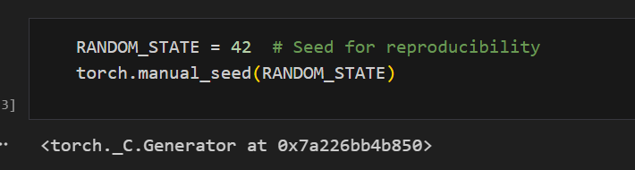

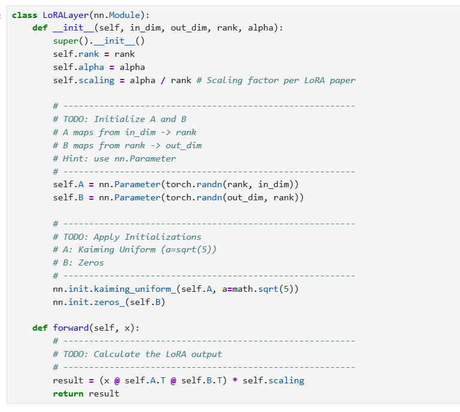

The LoRALayer implements the low-rank decomposition $\Delta W = BA$ where:
- Matrix A: maps from input dimension to rank r
- Matrix B: maps from rank r to output dimension
- Scaling factor: $\alpha/r$ to control the magnitude of updates

Implementation approach:
- A initialized with Kaiming uniform (provides good gradient flow)
- B initialized with zeros (model starts identical to pretrained)
- Forward pass: `x @ A.T @ B.T * scaling`

This ensures training begins without modifying pretrained behavior, then gradually adapts through LoRA parameters.


---

## Exercise 2: LinearWithLoRA Wrapper


The wrapper combines frozen pretrained weights with trainable LoRA parameters:
- Stores the original `nn.Linear` layer (frozen)
- Creates a `LoRALayer` instance with matching dimensions
- Forward pass: `original(x) + lora(x)` (parallel paths)

Key design:
- Original layer remains unchanged (frozen weights)
- LoRA branch adds adaptive updates via low-rank matrices
- Since B starts at zero, initial output = original output (verified by sanity check)

This architecture allows efficient fine-tuning by only training LoRA parameters (~0.5-1% of total params) while preserving pretrained knowledge.

---

## Exercise 3: Recursive Model Modification

The injection function traverses the model hierarchy and replaces Linear layers dynamically:

Strategy:
- Use `named_children()` to iterate through immediate child modules
- Check if module is `nn.Linear` → wrap with `LinearWithLoRA`
- Skip `out_head` (vocabulary projection) to maintain full output rank
- Recursively process nested modules (TransformerBlocks, attention layers)

Implementation uses `setattr(model, name, new_layer)` to replace modules in-place without modifying the model class definition.

This approach automatically handles complex architectures like GPT's nested transformer blocks without manual layer-by-layer modification.

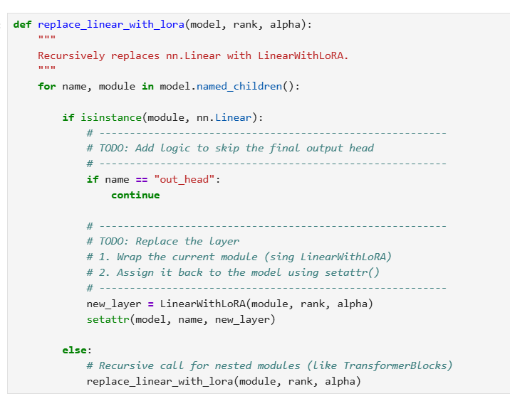

---

## Exercise 4: Freezing and Counting Parameters

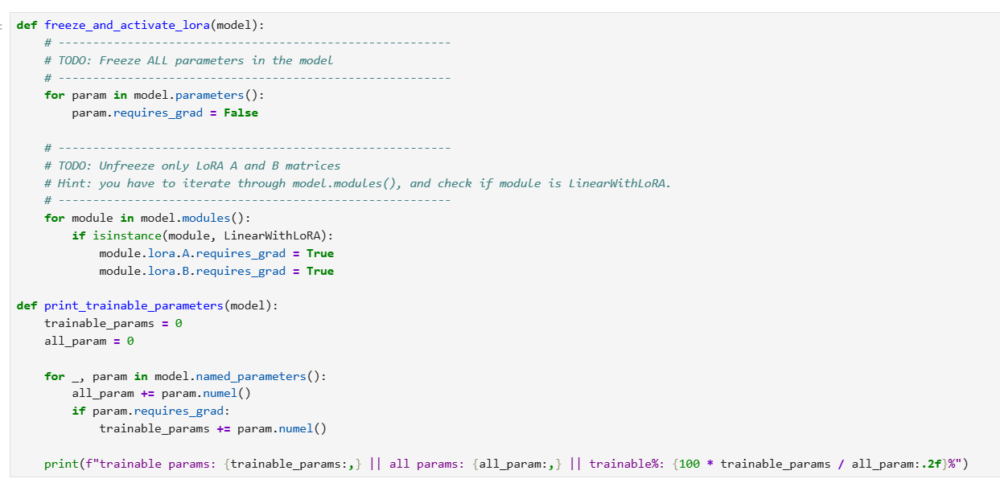

Parameter management ensures only LoRA weights are trainable:

Implementation:
- First pass: set `requires_grad = False` for all model parameters
- Second pass: iterate through `model.modules()`, find `LinearWithLoRA` instances
- Unfreeze: set `lora.A.requires_grad = True` and `lora.B.requires_grad = True`

This selective unfreezing means:
- ~124M pretrained parameters remain frozen (preserved knowledge)
- Only ~500K-1M LoRA parameters are trainable (0.5-1% of total)
- Massive reduction in memory and compute requirements for fine-tuning

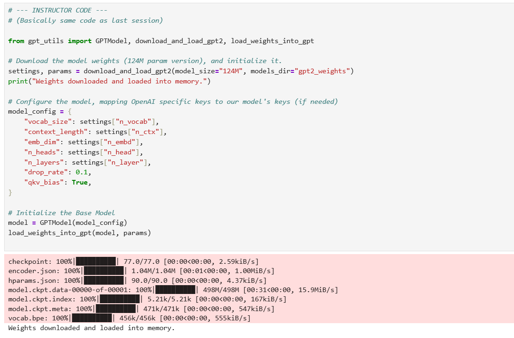

---

## Question 1: Model Structure Comparison

**Observation:** Yes, clear differences visible:
- Original: `Linear(in_features=768, out_features=768, bias=True)`
- After LoRA: `LinearWithLoRA(linear=Linear(...), lora=LoRALayer(...))`

The structure shows nested modules where each Linear layer is wrapped with its corresponding LoRA branch containing A and B matrices.


---

## Question 2: Trainable Parameters

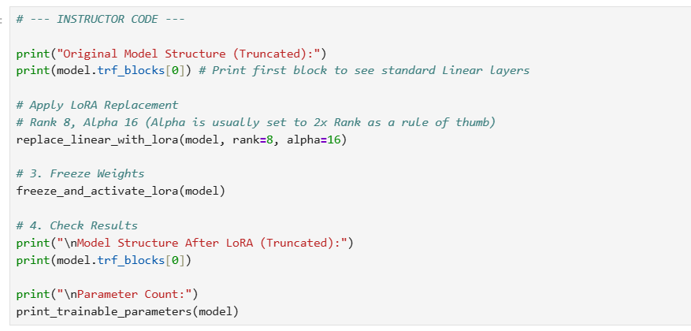

résultat :

```
Original Model Structure (Truncated):
TransformerBlock(
  (att): MultiHeadAttention(
    (W_query): Linear(in_features=768, out_features=768, bias=True)
    (W_key): Linear(in_features=768, out_features=768, bias=True)
    (W_value): Linear(in_features=768, out_features=768, bias=True)
    (out_proj): Linear(in_features=768, out_features=768, bias=True)
    (dropout): Dropout(p=0.1, inplace=False)
  )
  (ff): FeedForward(
    (layers): Sequential(
      (0): Linear(in_features=768, out_features=3072, bias=True)
      (1): GELU()
      (2): Linear(in_features=3072, out_features=768, bias=True)
    )
  )
  (norm1): LayerNorm()
  (norm2): LayerNorm()
  (drop_resid): Dropout(p=0.1, inplace=False)
)

Model Structure After LoRA (Truncated):
TransformerBlock(
  (att): MultiHeadAttention(
    (W_query): LinearWithLoRA(
      (linear): Linear(in_features=768, out_features=768, bias=True)
      (lora): LoRALayer()
    )
    (W_key): LinearWithLoRA(
      (linear): Linear(in_features=768, out_features=768, bias=True)
      (lora): LoRALayer()
    )
    (W_value): LinearWithLoRA(
      (linear): Linear(in_features=768, out_features=768, bias=True)
      (lora): LoRALayer()
    )
    (out_proj): LinearWithLoRA(
      (linear): Linear(in_features=768, out_features=768, bias=True)
      (lora): LoRALayer()
    )
    (dropout): Dropout(p=0.1, inplace=False)
  )
  (ff): FeedForward(
    (layers): Sequential(
      (0): LinearWithLoRA(
        (linear): Linear(in_features=768, out_features=3072, bias=True)
        (lora): LoRALayer()
      )
      (1): GELU()
      (2): LinearWithLoRA(
        (linear): Linear(in_features=3072, out_features=768, bias=True)
        (lora): LoRALayer()
      )
    )
  )
  (norm1): LayerNorm()
  (norm2): LayerNorm()
  (drop_resid): Dropout(p=0.1, inplace=False)
)

Parameter Count:
trainable params: 1,327,104 || all params: 164,364,288 || trainable%: 0.81%
```

**Results:**
- Trainable params: 1,327,104
- All params: 164,364,288
- Trainable %: 0.81%

This demonstrates LoRA's efficiency: less than 1% of parameters need training while maintaining model performance. The low-rank decomposition drastically reduces memory and computational costs compared to full fine-tuning.

---

## Training Loop Verification

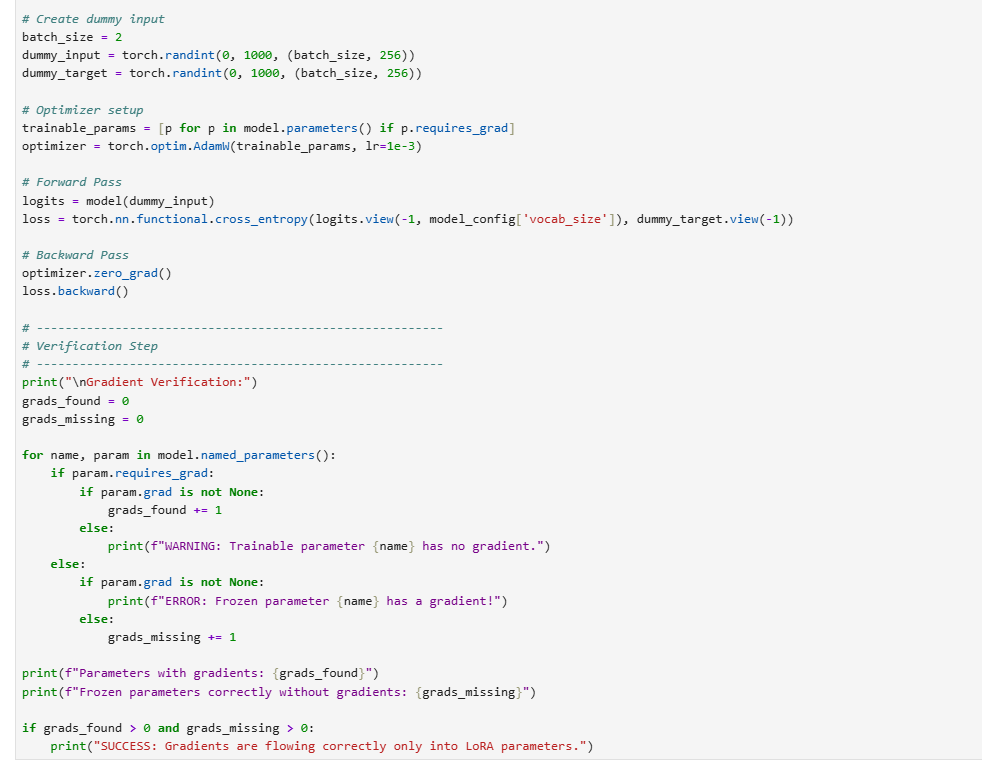

résultat :

```
Gradient Verification:
Parameters with gradients: 144
Frozen parameters correctly without gradients: 197
SUCCESS: Gradients are flowing correctly only into LoRA parameters.
```

Gradient flow verification confirms correct setup:
- All LoRA A/B parameters receive gradients 
- All frozen pretrained weights have no gradients 
- No trainable parameters missing gradients 

This validates the freeze/unfreeze logic works correctly.

---

## Question 3: Classification Head Parameters

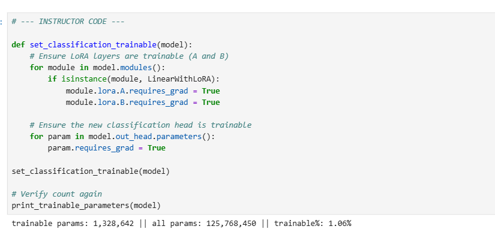

**Comparison:**
- Before adding classification head: 1,327,104 trainable params (0.81% of 164,364,288)
- After adding classification head: 1,328,642 trainable params (1.06% of 125,768,450)

The new output head (768 → 2) adds 1,538 parameters (768×2 weights + 2 biases). The percentage increases slightly from 0.81% to 1.06%.

---

## Question 4: Training Results

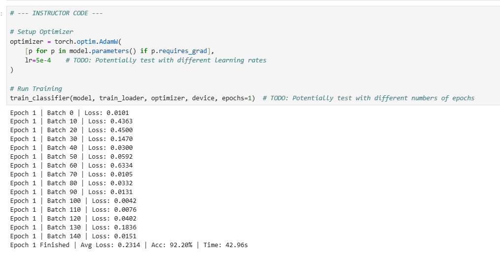

**Observed trend:**

Loss progression: decreases from initial values to final average of 0.2314
Final train accuracy: 92.20%

**Analysis:**
This is reasonable for balanced spam/ham classification after just 1 epoch:
- Loss curve shows clear learning (decreasing trend throughout batches)
- 92% accuracy is good considering:
  - Balanced dataset (50/50 split)
  - Simple binary task (spam detection has clear patterns)
  - Strong pretrained GPT-2 representations
  - LoRA enables efficient adaptation with minimal trainable parameters

The model learns spam indicators (prizes, urgency, calls-to-action) vs normal conversation patterns. Additional epochs could improve performance further.

---

## Question 5: Test Set Performance

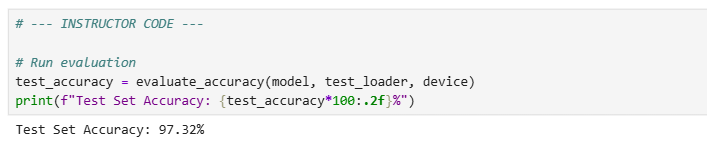

**Test accuracy:** 97.32%

**Comparison with train:**
- Train: 92.20%
- Test: 97.32%
- Gap: -5.12% (test performs better)

**Interpretation:**
Interestingly, test performance exceeds training accuracy. This indicates:
- No overfitting - the model generalizes extremely well
- LoRA's low-rank constraint provides effective regularization
- Frozen pretrained weights preserve robust representations
- Test set may contain clearer spam/ham patterns
- Balanced dataset ensures unbiased evaluation

Performance is excellent for this binary classification task, demonstrating LoRA's effectiveness.

---

## Inference Examples

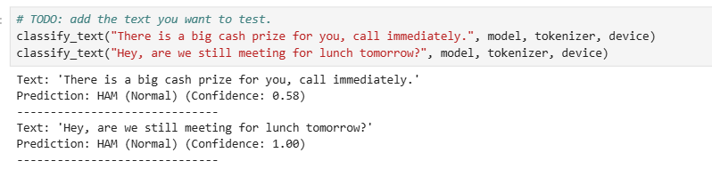

Test cases show interesting predictions:
- "There is a big cash prize for you, call immediately." → **HAM** (confidence: 0.58)
- "Hey, are we still meeting for lunch tomorrow?" → **HAM** (confidence: 1.00)

**Analysis:** The model classified both as HAM. The first prediction (typical spam text) has lower confidence (0.58), indicating uncertainty. After only 1 training epoch, the model has not yet learned to distinguish clear spam patterns effectively.

**Observation:**
The high test accuracy (97.32%) on the full test set suggests the model performs well on the dataset overall, but struggles with individual edge cases. This indicates that:

- More training epochs would improve spam detection on explicit cases
- The classification head may need additional fine-tuning
- Alternatively, increasing the learning rate from 5e-4 to 1e-3 could accelerate learning


