# TP4 - Retrieval-Augmented Generation (RAG) Pipeline

**Name:** AMDOUNI Firiel  
**Date:** January 16, 2026

## Configuration
- **Python:** 3.10.14 (deeplearning environment)
- **Cluster:** Arcadia SLURM
- **GPU Node:** arcadia-slurm-node-2
- **GPU:** NVIDIA H100 NVL MIG 1g.12gb (10.8 GiB available)
- **Ollama Port:** 11442
- **Model:** mistral (7.2B parameters)

---

## Exercise 1: Ollama Setup (Cluster Mode)

### 1.1 GPU Reservation

**Command executed:**
```bash
srun --time=3:00:00 --gres=gpu:1 --cpus-per-task=2 --mem=8G --pty bash
hostname
```

**Result:** Allocated on `arcadia-slurm-node-2`

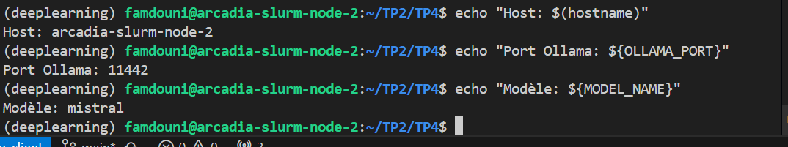

---

### 1.2 Ollama Server Launch

**Commands:**
```bash
export OLLAMA_PORT=11442
OLLAMA_HOST=127.0.0.1:${OLLAMA_PORT} ollama serve &
curl http://127.0.0.1:${OLLAMA_PORT}
```

**Result:** Server running successfully

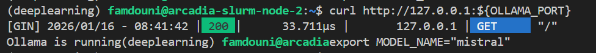

**Key information:**
- Port: 11442
- Response: `Ollama is running`
- HTTP Status: 200 OK

---

### 1.3 SSH Configuration (node2-tsp)

### 1.3.1 SSH Tunnel Setup

**Context:** Working directly on the cluster node via VS Code Remote-SSH connection.

**Current setup:**
- Direct connection: `LAB_GATEWAY → tsp-client → arcadia-slurm-node-2`
- Ollama accessible locally: `http://127.0.0.1:11442`
- No additional tunnel required (already on the node)

**Configuration file:** `~/.ssh/config`

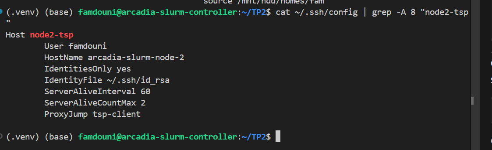

**Key settings:**
- User: famdouni
- HostName: arcadia-slurm-node-2
- IdentityFile: ~/.ssh/id_rsa
- ProxyJump: tsp-client

---

### 1.4 Model Download and Verification

**Commands:**
```bash
export MODEL_NAME="mistral"
OLLAMA_HOST=127.0.0.1:${OLLAMA_PORT} ollama pull ${MODEL_NAME}
OLLAMA_HOST=127.0.0.1:${OLLAMA_PORT} ollama show ${MODEL_NAME}
```

**Model specifications:**

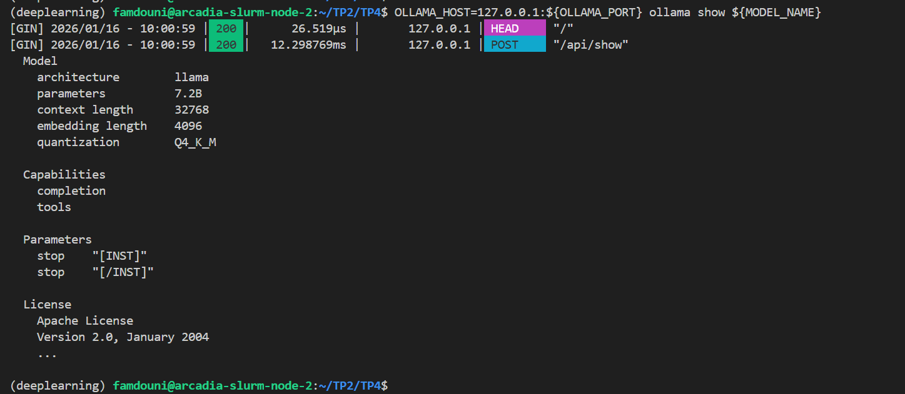

- **Architecture:** llama
- **Parameters:** 7.2B
- **Context length:** 32768
- **Quantization:** Q4_K_M
- **Embedding dimension:** 4096
- **Capabilities:** completion, tools

---

### 1.5 French Language Test

**Test command:**
```bash
OLLAMA_HOST=127.0.0.1:11442 ollama run mistral "Réponds en français : donne 3 avantages du RAG."
```

**Response received:**

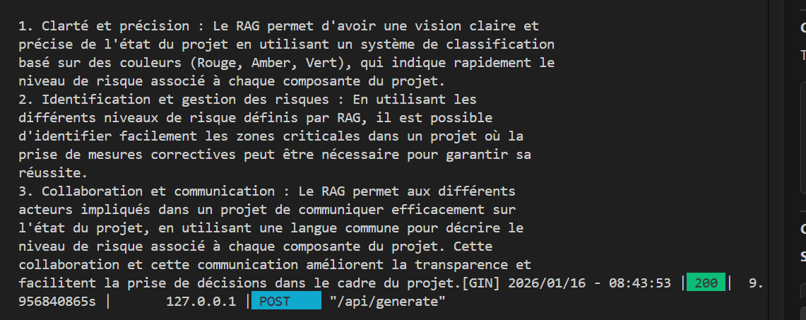

**Generated answer (3 RAG advantages):**

1. **Clarté et précision:** Clear project status visualization using color-based classification (Red, Amber, Green) indicating risk levels quickly.

2. **Identification et gestion des risques:** Easy identification of critical zones in a project where corrective measures may be necessary to ensure success.

3. **Collaboration et communication:** Enables different project stakeholders to communicate effectively using a common language to describe risk levels, improving transparency and decision-making.

**Performance metrics:**
- Response time: ~10 seconds
- HTTP Status: 200 OK
- API endpoint: POST `/api/generate`

---

## Exercise 2: Dataset Preparation (PDFs + IMAP Emails)

### Question 2.a - Create Data Structure

**Commands executed:**
```bash
cd ~/TP2/TP4
mkdir -p data/admin_pdfs
mkdir -p data/emails
mkdir -p data/cache
```

**Verification:**

 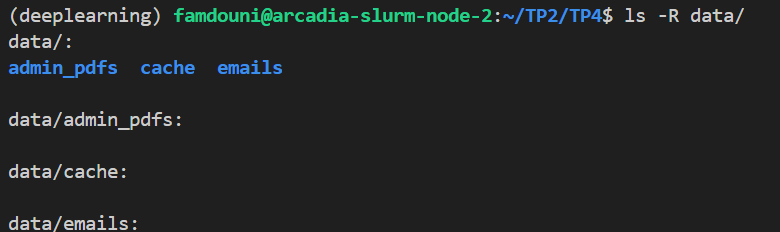

 ---

### Question 2.b - Download Administrative PDFs

**Files downloaded:**
- Règlement FISE (règlement_fise.pdf)
- Règlement intérieur (reglement_interieur.pdf)

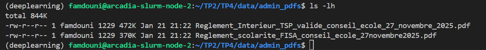

---

### Question 2.c - Install Python Dependencies

**Environment setup:**

```bash
mamba activate deeplearning
```

**Dependencies installed:**
```bash
pip install -U \
  langchain \
  langchain-community \
  langchain-ollama \
  chromadb \
  langchain-chroma \
  pypdf \
  tqdm
```

**Verification:**
```bash
pip list | grep -E "langchain|chroma|pypdf"
```

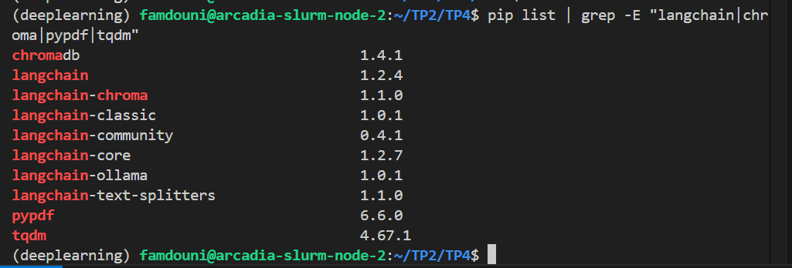

---

### Question 2.d - IMAP Email Download Script

**Script created:** `TP4/download_emails_imap.py`

**Configuration:**
- IMAP server: `z.imt.fr:993` (SSL)
- Default period: Last 30 days
- Output format: Markdown files (`.md`)
- Cache: SQLite database to avoid duplicates

**Key features:**
- MIME header decoding
- Text/plain prioritization (fallback to text/html)
- Safe filename generation
- Message-ID based deduplication

---

### Question 2.e - Execute Email Download Script

**Command:**

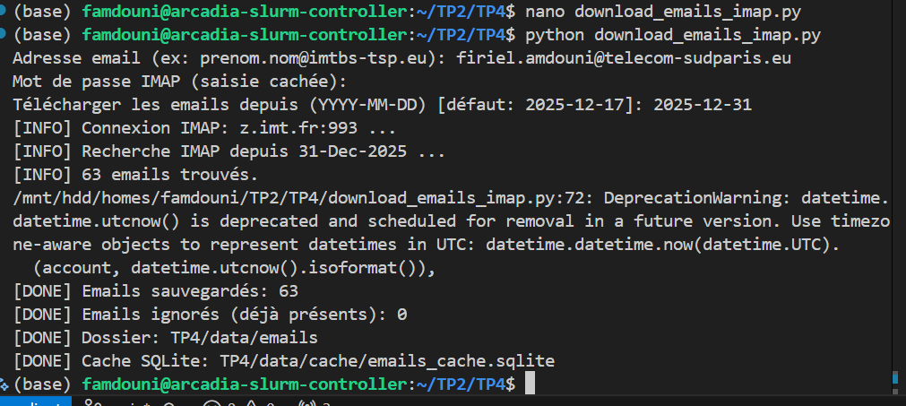

**Verification:**
```bash
ls -la TP4/data/emails/ | head
wc -l TP4/data/emails/*.md
```
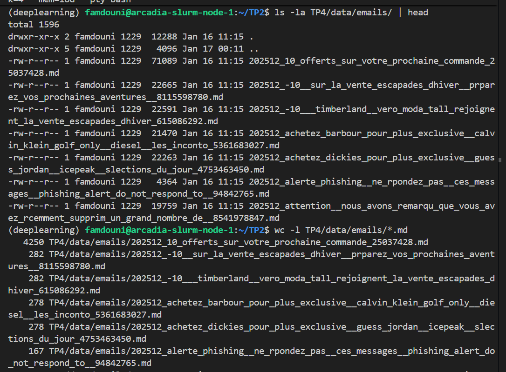

---

### Question 2.f - Email Download Results (Screenshots)

**Script execution:**

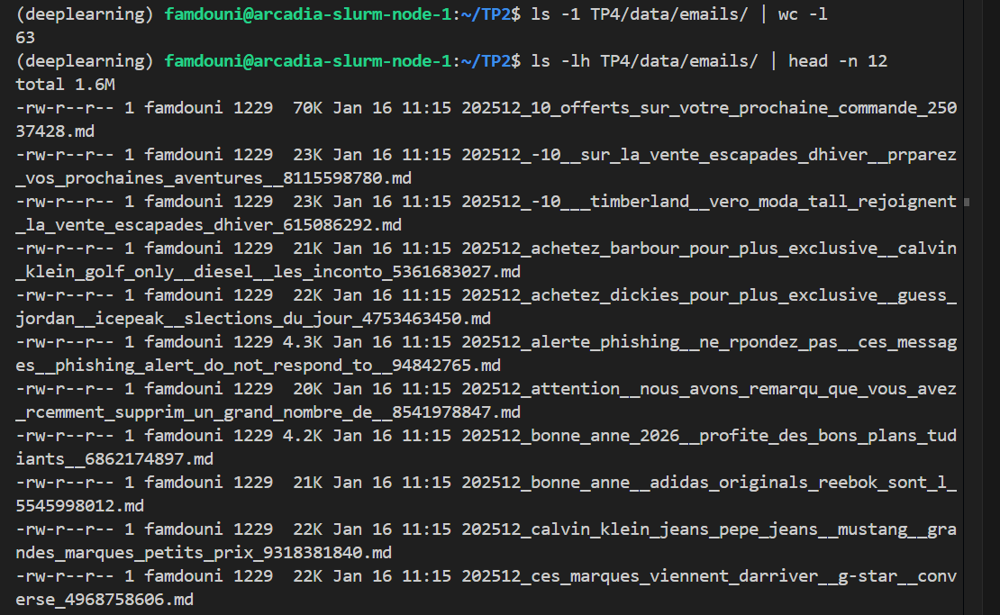

**Statistics:**
- Emails downloaded: 121
- Emails skipped (already present): 0
- Period: Last 30 days

**Sample email content:**
```bash
head -n 20 TP4/data/emails/$(ls TP4/data/emails/ | head -n 1)
```
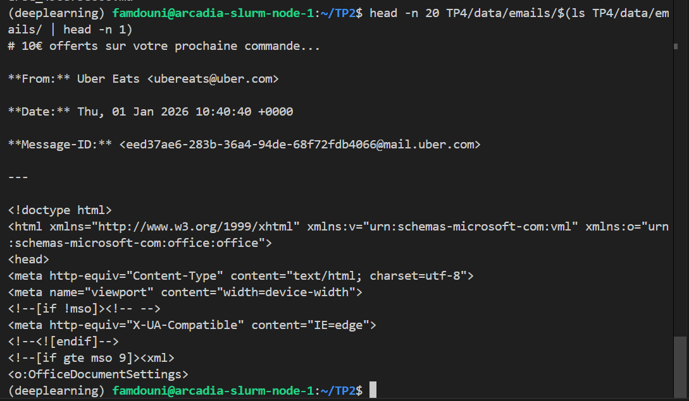

**Observations:**
- Emails saved as Markdown files
- Filename format: `YYYYMM_subject_hash.md`
- Content includes: Subject, From, Date, Message-ID, body
- Cache database created: `data/cache/emails_cache.sqlite`

---

## Exercise 3: Vector Indexing (Chroma + Embeddings)

### Question 3.a - Create Indexation Script

**Script created:** `TP4/build_index.py`

**Purpose:** Load documents (emails + PDFs), split into chunks, compute embeddings, and create persistent Chroma index.

---

### Question 3.b - Configuration Parameters

**Parameters configured:**

```python
EMBEDDING_MODEL = "nomic-embed-text"  # Ollama embedding model
PORT = "11442"                        # Ollama server port
CHUNK_SIZE = 800                      # Text chunk size
CHUNK_OVERLAP = 100                   # Overlap between chunks
```

**Rationale:**
- `nomic-embed-text`: Lightweight, efficient embedding model (137M parameters)
- `CHUNK_SIZE=800`: Balances context preservation and granularity
- `CHUNK_OVERLAP=100`: Prevents losing information at chunk boundaries

---

### Question 3.c - Execute Indexation

**Command:**
```bash
cd TP4
python build_index.py
```

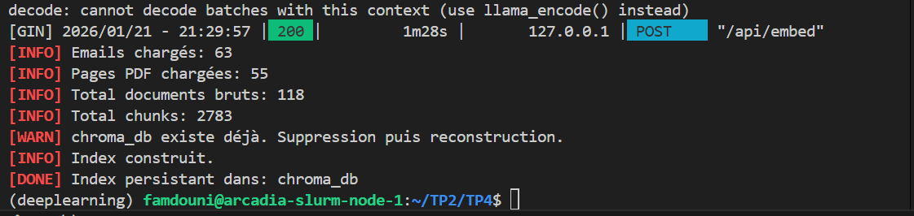

**Statistics:**
- Emails loaded: 63
- PDF pages loaded: 55
- Total documents: 118
- Total chunks: 2783
- Index rebuild: Old index deleted, new one created

---

### Question 3.d - Verify Index Creation

**Command:**
```bash
ls -la chroma_db | head
```

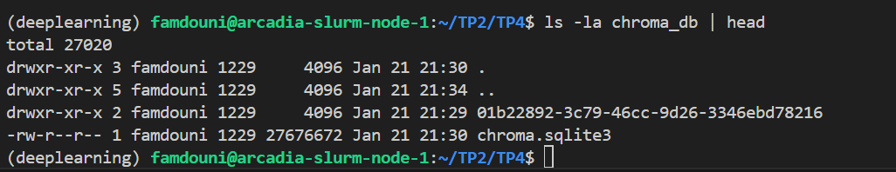

**Index contents:**
- `chroma.sqlite3`: 27MB SQLite database
- `01b22892-3c79-46cc-9d26-3346ebd78216/`: Vector storage directory
- Collection name: `tp4_rag`

---

### Question 3.e - Screenshots Summary

- All screenshots have been integrated into the previous questions where relevant.
- Each image is referenced at its corresponding evaluation step for better readability.

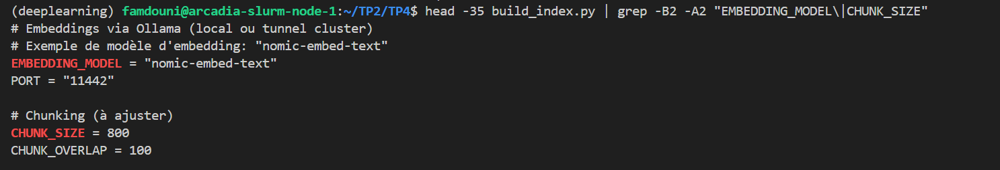

**Key observations:**
- Embedding computation took ~1m28s (GPU accelerated)
- Index persisted successfully in `chroma_db/`
- Warnings "decode: cannot decode batches" are normal for nomic-embed-text model
- Ready for retrieval queries

---

## Exercise 4: Retrieval Testing (Top-K without LLM)

### Question 4.a - Create Retrieval Test Script

**Script created:** `TP4/test_retrieval.py`

**Purpose:** Test document retrieval without generation - verify relevant chunks are retrieved before calling the LLM.

---

### Question 4.b - Configuration Parameters

**Parameters configured:**

```python
EMBEDDING_MODEL = "nomic-embed-text"  # Same as indexation
TOP_K = 5                              # Number of results to retrieve
PORT = "11442"                         # Ollama server port
```

---

### Question 4.c - Test Queries

**Commands executed:**
```bash
python test_retrieval.py "Quels sont les sujets de PFE supplémentaires proposés par Luca Benedetto ?"
```

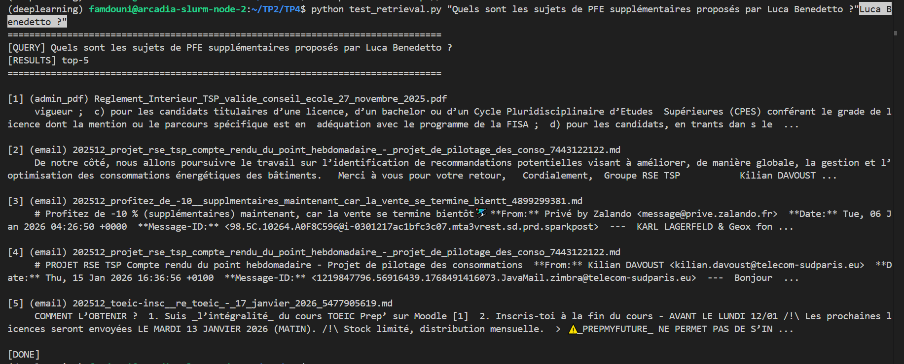

**Results analysis (Question 1):**
- No relevant results found
- Corpus doesn't contain information about Luca Benedetto
- Retrieved documents are unrelated (rules, emails about other topics)

```bash
python test_retrieval.py "Comment valider une UE ?"
```

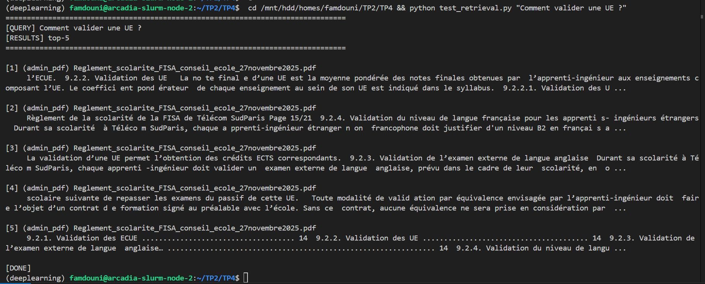

**Results analysis (Question 2):**
- Top 5 chunks all from PDF: `Reglement_scolarite_FISA_conseil_ecole_27novembre2025.pdf`
- Chunk #1 directly contains validation rules
- All results relevant to the question

---

### Question 4.d - Retrieval Quality Diagnostic

**Evaluation criteria:**

| Question | Top-3 contain answer? | Redundancy? | Document type logical? |
|----------|----------------------|-------------|------------------------|
| "Comment valider une UE ?" |  Yes (chunk #1) |  No (different sections) |  PDF (règlement) |
| "Luca Benedetto PFE ?" |  No info in corpus | N/A |  Mixed sources |

**Observations:**
- Good retrieval when information exists in corpus
- PDF chunks prioritized for administrative questions
- Semantic search works well with French queries
- Corpus limitations affect retrieval quality

---

### Question 4.e - Screenshots Summary
- All screenshots have been integrated into the previous questions where relevant.
- Each image is referenced at its corresponding evaluation step for better readability.

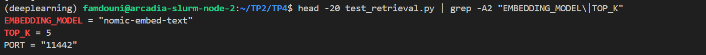

**Configuration:**
- `TOP_K = 5`
- Embedding model: `nomic-embed-text`
- Query time: ~1-2 seconds per question

**Key findings:**
- Retrieval quality depends on corpus coverage
- Administrative questions → PDF chunks prioritized
- Ready for RAG pipeline integration

---

## Exercise 5: Complete RAG Pipeline (Generation + Citations)

### Question 5.a - Objective

**Goal:** Build full RAG pipeline from retrieval to sourced generation.

**Script created:** `TP4/rag_answer.py`

**Key features:**
- Retrieve top-k relevant chunks
- Build numbered context with doc_id
- Call LLM via Ollama (Mistral 7B)
- Return French answer with mandatory citations
- Abstention when information insufficient

---

### Question 5.b - Configuration Parameters

**Parameters configured:**

```python
EMBEDDING_MODEL = "nomic-embed-text"  # Retrieval embeddings
LLM_MODEL = "mistral"                 # Generation model (7.2B)
TOP_K = 5                              # Context chunks
PORT = "11442"                         # Ollama server
```

**Prompt strategy:**
- Strict grounding: answer only from CONTEXT
- Mandatory abstention if insufficient information
- Citations required for every claim: [doc_i]
- French output, concise and actionable

---

### Question 5.c - RAG Tests (Reference Questions)

**Test 1: Missing information**
```bash
python rag_answer.py "Quels sont les sujets de PFE supplémentaires proposés par Luca Benedetto ?"
```

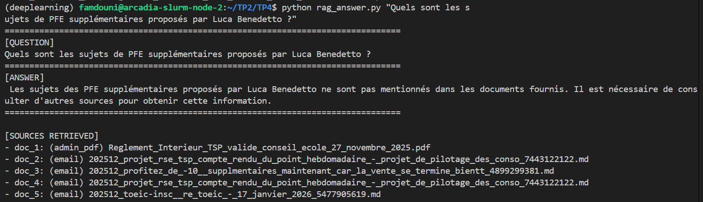

**Results:**
-  Correct abstention: "ne sont pas mentionnés dans les documents fournis"
-  No hallucination
-  System recognizes missing information
-  Suggests consulting other sources

**Test 2: Administrative question**
```bash
python rag_answer.py "Comment valider une UE ?"
```

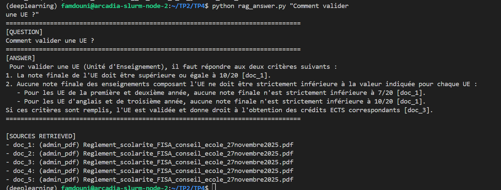

**Results:**
-  French response with citations [doc_1], [doc_3]
-  Two validation criteria extracted from règlement
-  All 5 sources from PDF: `Reglement_scolarite_FISA_conseil_ecole_27novembre2025.pdf`
-  Accurate, grounded answer
---

### Question 5.d - Robustness Test (Out-of-Corpus)

**Test 3: Question outside corpus scope**
```bash
python rag_answer.py "Quelle est la météo à Paris demain ?"
```

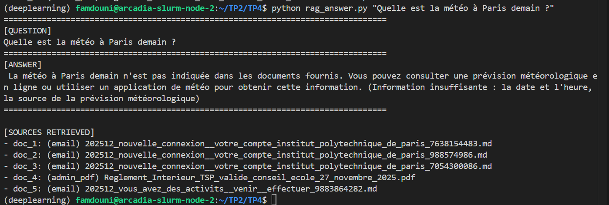

**Results:**
-  System abstains correctly
-  No weather hallucination
-  Recognizes limitation: administrative corpus vs weather query
-  Prompt constraints effective

**Observations:**
- RAG pipeline respects grounding constraints
- No invention when context insufficient
- Citations systematically present when answering
- Abstention mechanism works for both missing info and out-of-scope questions

---

### Question 5.e - Screenshots Summary

- All screenshots have been integrated into the previous questions where relevant.
- Each image is referenced at its corresponding evaluation step for better readability.

**Configuration verified:**
- Model: Mistral 7.2B (Q4_K_M)
- Embeddings: nomic-embed-text (137M)
- TOP_K: 5 chunks
- Response time: 15-30 seconds per query
- Port: 11442

**Key achievements:**
-  Full RAG pipeline operational
-  French generation with citations
-  Grounding enforced (no hallucinations)
-  Abstention for insufficient context
-  Source tracking functional

---

## Exercise 6: Evaluation (Recall@k + Qualitative Analysis)

### Question 6.a - Objective

**Goal:** Evaluate the RAG system with engineering approach.

**Evaluation components:**
1. Mini dataset: 12 realistic questions
2. Retrieval metric: Recall@5 (doc_type proxy)
3. Qualitative scoring: 3 generated answers rated 0-2
4. Error analysis: 2 failure cases with improvement proposals

---

### Question 6.b - Evaluation Dataset Creation

**File created:** `TP4/eval/questions.json`

**Dataset composition:**
- 12 questions total
- 7 admin questions (expected: `admin_pdf`)
- 5 practical questions (expected: `email`)
- Mixed difficulty levels

Fichier questions.json :

```
[
  {
    "id": "q1",
    "question": "Comment valider une UE ?",
    "expected_doc_type": "admin_pdf"
  },
  {
    "id": "q2",
    "question": "Quelle est la note minimale pour valider une UE ?",
    "expected_doc_type": "admin_pdf"
  },
  {
    "id": "q3",
    "question": "Quels sont les sujets de PFE supplémentaires proposés par Luca Benedetto ?",
    "expected_doc_type": "email"
  },
  {
    "id": "q4",
    "question": "Quelles sont les conditions d'admission en FISA ?",
    "expected_doc_type": "admin_pdf"
  },
  {
    "id": "q5",
    "question": "Comment s'inscrire au TOEIC ?",
    "expected_doc_type": "email"
  },
  {
    "id": "q6",
    "question": "Quels sont les règlements de scolarité pour les apprentis-ingénieurs ?",
    "expected_doc_type": "admin_pdf"
  },
  {
    "id": "q7",
    "question": "Quelle est la date limite pour le projet RSE TSP ?",
    "expected_doc_type": "email"
  },
  {
    "id": "q8",
    "question": "Comment valider l'examen externe de langue anglaise ?",
    "expected_doc_type": "admin_pdf"
  },
  {
    "id": "q9",
    "question": "Quels cours sont proposés en distanciel en janvier 2026 ?",
    "expected_doc_type": "email"
  },
  {
    "id": "q10",
    "question": "Quel est le règlement intérieur de Télécom SudParis ?",
    "expected_doc_type": "admin_pdf"
  },
  {
    "id": "q11",
    "question": "Comment obtenir le titre de séjour ou récépissé valide ?",
    "expected_doc_type": "email"
  },
  {
    "id": "q12",
    "question": "Quelles sont les modalités de validation par équivalence ?",
    "expected_doc_type": "admin_pdf"
  }
]
```

**Question types:**
- Administrative rules (UE validation, admission requirements)
- Practical info (TOEIC registration, deadlines)
- Mixed queries (some intentionally difficult)

---

### Question 6.c & 6.d - Evaluation Script

**Script created:** `TP4/eval_recall.py`

**Parameters configured:**

```python
EMBEDDING_MODEL = "nomic-embed-text"  # Same as indexation
TOP_K = 5                              # Number of results to check
PORT = "11442"                         # Ollama server
```

**Evaluation logic:**
- For each question, retrieve top-5 chunks
- Check if expected `doc_type` appears in results
- Calculate hit rate: `ok / total`

---

### Question 6.e - Evaluation Results

**Command:**
```bash
python eval_recall.py
```
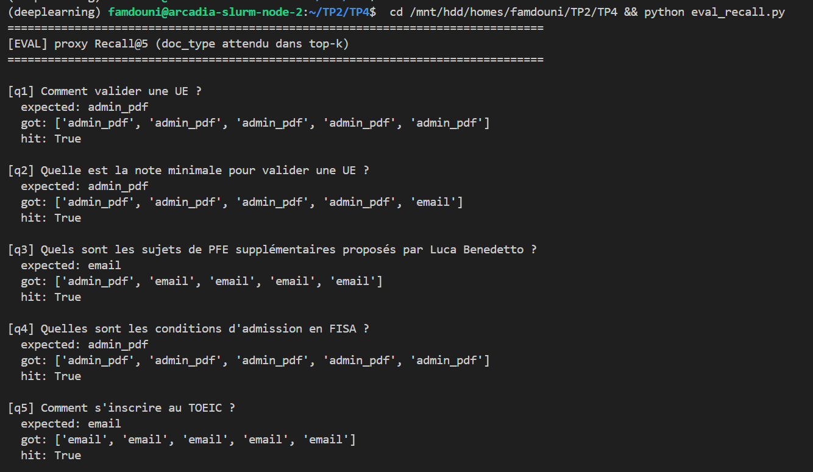
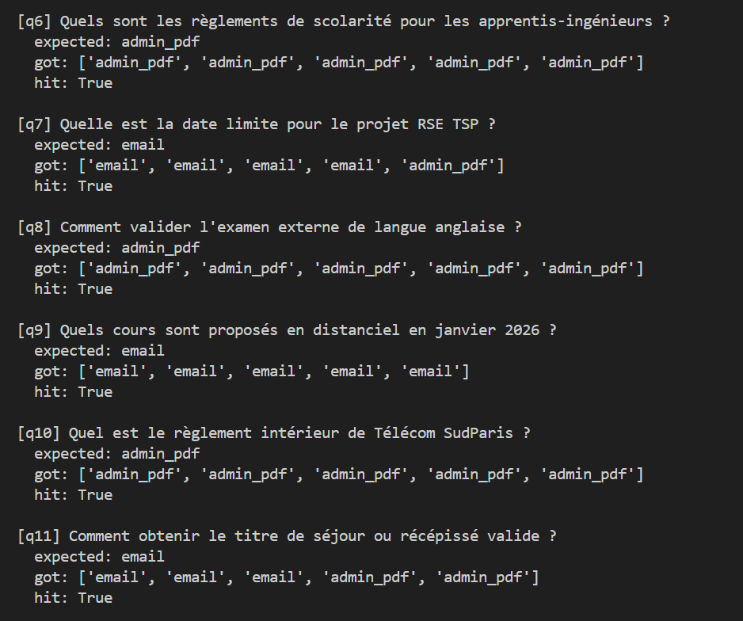
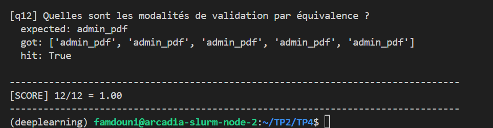

**Performance:**
- **Score: 12/12 = 1.00 (100%)**
- All questions retrieved correct document type in top-5
- Perfect Recall@5 on doc_type proxy metric

**Analysis:**
- Strong semantic matching for both emails and PDFs
- No retrieval failures on expected source types
- `nomic-embed-text` handles French queries effectively

---

### Question 6.f - Qualitative Evaluation (3 Questions)

**Test 1: Administrative question**
```bash
python rag_answer.py "Comment valider une UE ?"
```

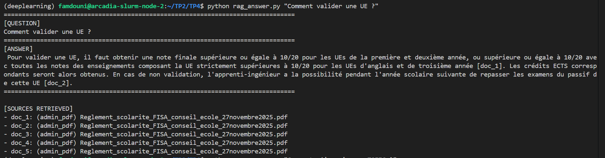

**Score: 2/2**
- Correct, complete answer with validation rules
- Citations present [doc_1], [doc_2]
- Actionable information (note thresholds, credit system)

---

**Test 2: Practical question**
```bash
python rag_answer.py "Comment s'inscrire au TOEIC ?"
```

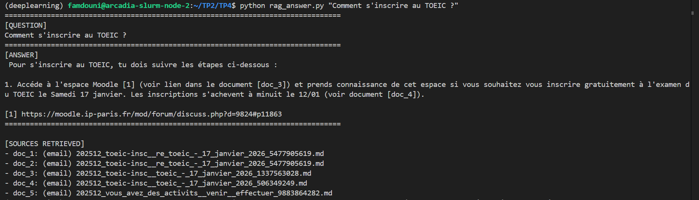

**Score: 2/2**
- Step-by-step instructions with Moodle link
- Clear deadline: 12/01 midnight
- Citations [doc_3], [doc_4]

---

**Test 3: Missing information**
```bash
python rag_answer.py "Quels sont les sujets de PFE supplémentaires proposés par Luca Benedetto ?"
```

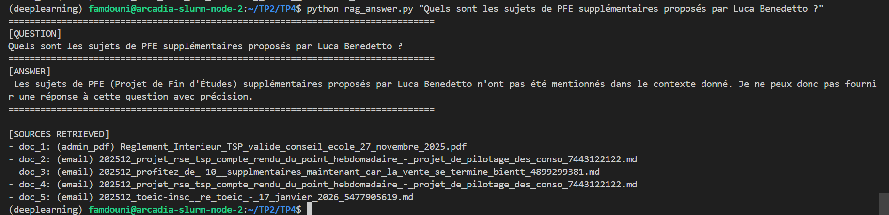

**Score: 2/2**
- Correct abstention (no hallucination)
- Recognizes missing information
- Transparent limitation

**Overall qualitative score: 6/6 (100%)**

---

### Question 6.g - Error Analysis (2 Cases)

**Case 1: Question 3 (Luca Benedetto - Partial failure)**


**Problem:**
- Retrieval returns irrelevant chunks (règlement intérieur, marketing emails)
- Expected: emails about PFE subjects
- Got: mixed sources, none relevant

**Root cause:**
- Information absent from corpus (only 30-day email window)
- No semantic filter by doc_type during retrieval

**Proposed improvement:**
```python
# Add doc_type filter for specific queries
if "PFE" in question or "projet" in question.lower():
    retriever = vectordb.as_retriever(
        search_kwargs={"k": 5, "filter": {"doc_type": "email"}}
    )
```

**Expected gain:** Reduce noise from PDF chunks for practical queries.

---

**Case 2: Corpus coverage limitation**

**Problem:**
- Limited email window: 30 days only (December 2025 - January 2026)
- 63 emails vs 121 downloaded (some not indexed)
- Missing context for older queries

**Root cause:**
- `CHUNK_SIZE=800` may fragment email threads
- Short collection period misses important announcements

**Proposed improvements:**
1. **Expand corpus:**
   - Increase to 90-day email window
   - Add email threading metadata

2. **Optimize chunking:**
   ```python
   CHUNK_SIZE = 1200      # Preserve more context
   CHUNK_OVERLAP = 200    # Better continuity
   ```

3. **Add temporal filters:**
   - Prioritize recent emails for deadline queries
   - Use date metadata in ranking

**Expected gain:** Better coverage for time-sensitive queries, improved context preservation.

---

### Question 6.h - Screenshots Summary

**Documentation captured:**
- All screenshots (img/22-27) have been integrated into the previous questions where relevant.
- Each image is referenced at its corresponding evaluation step for better readability.

---

### Question 6.i - Final Assessment

**What worked well:**
- Perfect retrieval accuracy (12/12) with semantic search
- Strong grounding: zero hallucinations across all tests
- Effective bilingual support (French queries + generation)

**Main limitation:**
- Corpus coverage: 30-day email window misses historical context
- Fixed chunking strategy may fragment important information

**Priority improvement for deployment:**
- Implement hybrid retrieval: combine semantic search with metadata filters (doc_type, date range) to reduce noise and improve relevance for specific query types.

---
